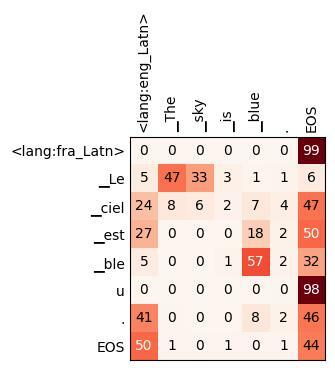
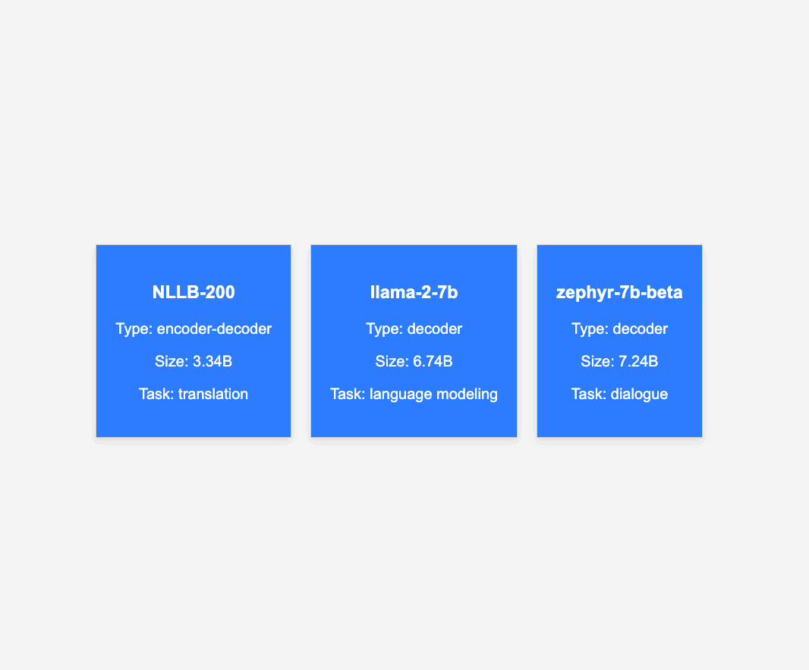

<p align="center">
  
  <br />
</p>

*Pasero* means 'sparrow' in Esperanto, as a reference to its big brother [NAVER Papago](https://papago.naver.com).

Pasero is a lightweight text generation framework, inspired from fairseq, and initially intended for machine translation only. It can now do speech translation and language modeling as well and supports a number of popular pre-trained models (Llama, T5, Whisper, etc.)

The goal of Pasero is to make the user's life simpler by reducing the amount of configuration and manual preprocessing that is required.

## Features

Here are some nice things that Pasero can do:

- [Reproduce our winning low-resource speech translation system at IWSLT 2023](examples/IWSLT2023/README.md)
- [Train multilingual machine translation models](examples/ParaCrawl-Euro/README.md) and our [language adapters](#finetuning-and-training-adapters)
- Finetune large language models like Llama-2 on tasks like [machine translation](examples/Llama/README.md#finetune-llama-on-french-english-machine-translation) or [dialogue](examples/Llama/README.md#finetune-llama-on-dialogue)
- [Do parameter-efficient adaptation with bottleneck adapters](#finetuning-and-training-adapters) or [LoRA](examples/Llama/README.md#finetune-llama-on-french-english-machine-translation)
- [Finetune or decode from the dense NLLB-200 models](examples/NLLB-200/README.md#nllb-200-dense-models)
- [Decode from the NLLB-200 Mixture-of-Experts model and prune its experts](examples/NLLB-200/README.md#nllb-200-mixture-of-experts)
- [Decode from LLMs/chatbots & deploy them with a simple web-based playground and HTTP API](#web-api-and-playground)

Other supported pre-trained models include the [Whisper Speech-to-Text models](examples/Whisper), [FLAN-T5 and mT5](examples/FLAN-T5), BLOOM, MPT, etc.

## Installation

Pasero can be installed as follows (it requires **Python >= 3.9**):

```bash
git clone https://github.com/naver/pasero.git
cd pasero
pip install -e .

mkdir -p tmp data models  # should be on a shared filesystem
```

Optionally install flash attention following [these steps](https://github.com/Dao-AILab/flash-attention?tab=readme-ov-file#installation-and-features).

The examples in this README assume the existence of `data` and `models` directories, but those are not strictly necessary. However,
Pasero will need a shared `tmp` directory located at the Pasero root to store its SLURM logs and dataset indexes.

If you want these to be stored at a different location, just create symbolic links like this:

```bash
ln -s SOME_SHARED_FILESYSTEM/data .
ln -s SOME_SHARED_FILESYSTEM/models .
ln -s SOME_SHARED_FILESYSTEM/tmp .
```

### Training and evaluation data

To run the examples below, you will need to download some data. If you are limited in terms of disk size, compute, or just time, it is best to skip the ParaCrawl download and examples.

```bash
# Recommended (quite fast):
examples/download-TED.sh           # TED Talks training and evaluation data
examples/download-flores.sh        # FLORES evaluation data
# Optional (can take a few hours):
examples/ParaCrawl/download.sh fr  # ParaCrawl French-English corpus
```

### Training a BPE model

`pasero-build-tokenizer` can be used to create BPE models and Pasero dictionaries (and also for tokenizing text with an existing model). This tokenizer is similar to SentencePiece but applies [inline casing](https://aclanthology.org/W19-5361/) by default: all subwords are lowercase, but are followed by a special token indicating their case. For instance:
`Welcome to the US.` -> `▁welcome <T> ▁to ▁the ▁us <U> .` While this tokenizer is the default, any SentencePiece or HuggingFace tokenizer can also be used with `--tokenizer sentencepiece|hf` and `--tokenizer-path`.

To train the baseline MT models in [examples](/examples) (e.g., `TED/training.yaml`, `TED-top20/training.yaml`, `ParaCrawl/training.yaml`) you'll need the following BPE models.
Note that they are also made available in the respective examples directories (e.g., `examples/TED/de-en/bpecodes`) and automatically copied to `data` by the download scripts.

#### Bilingual (TED German-English):
```bash
pasero-build-tokenizer -i data/TED/train.{de,en} -o data/TED/de-en/bpecodes -d data/TED/de-en/dict.txt -s 8000
```

The `-s 8000` option will create 8000 merge operations, resulting in a dict of size a bit over 8000. The dictionary includes all BPE merges plus all high-frequency characters.

#### Bilingual (ParaCrawl French-English):
```bash
pasero-build-tokenizer -i data/ParaCrawl/ParaCrawl.en-fr.{en,fr} -o data/ParaCrawl/fr-en/bpecodes -d data/ParaCrawl/fr-en/dict.txt -s 16000 --dict-min-freq 100 --nfkc
```

Here, `--dict-min-freq 100` increases the frequency threshold for a character to be in the dictionary (default: 10). And `--nfkc` does Unicode normalization like in SentencePiece.

####  Multilingual (TED top 20):
```bash
pasero-build-tokenizer -i data/TED/train.{en,ar,he,ru,ko,it,ja,zh_cn,es,fr,pt_br,nl,tr,ro,pl,bg,vi,de,fa,hu} \
-o data/TED/top20/bpecodes -d data/TED/top20/dict.txt -s 64000 --temperature 5 --lang-codes \
--vocab-path data/TED/top20/dict.{lang}.txt
```

The `--temperature` option alters token frequencies to give more room in the BPE vocab for lower-resource languages. A high temperature will cause all languages to be equally represented regardless of the amount of data.
The `--lang-codes` option will append the language codes (e.g., `<lang:en>`) of the given languages to the dict (either the file extensions or the arguments of `--lang-codes` if any).

Finally, `--vocab-path` is optional and it creates a dict per language (optional), which is useful for [language-specific vocabulary filtering](https://arxiv.org/abs/2109.06679).

### About dictionaries

Dictionaries (aka `dict.txt` files) are important for Pasero to map tokens to their ids (and associate them with the corresponding row in the embedding matrix).

The dictionary format is the same as in fairseq: one token per line, optionally followed by a whitepace and the token's frequency. By default, like in fairseq, special tokens are not in the dict file, but are automatically prepended at dictionary loading: this causes the token ids to be shifted by 4 positions (the id of the first token in the dictionary is 4) and special tokens to be given "standard" fairseq values (PAD id = 1, BOS and EOS ids = 2, UNK id = 3).

To specify different ids for these special tokens, they can be manually added to the dictionary at the relevant positions (in which case, Pasero won't add them again).

With `--tokenizer hf`, this dictionary is optional since the HuggingFace tokenizer's vocab will be used by default.
HuggingFace-style dictionary files are also allowed (i.e., json format). This is automatically inferred from the file's extension: `--dict dict.txt` for a fairseq-style dictionary and `--dict dict.json` for a HuggingFace-style one.

### Other uses of the Pasero Tokenizer

#### Tokenization:
```bash
pasero-tokenize data/TED/de-en/bpecodes < data/TED/train.de > data/TED/train.tok.de
```
#### Detokenization:
```bash
pasero-detokenize < data/TED/train.tok.de > data/TED/train.detok.de
```
#### Dictionary creation:
```bash
pasero-build-dict < data/TED/train.tok.de > data/TED/dict.de.txt
```
This command can be used to create a dictionary from an existing tokenizer (e.g., SentencePiece).

## Training models

Models can be trained by creating a YAML configuration file and running `pasero-train -c CONFIG_FILE`. Some documented examples can be found in [examples](/examples). The best strategy for creating a configuration is to copy a similar existing configuration and modify the relevant options.

All parameters already defined in a config file can be overridden by command line options. For instance `pasero-train -c CONFIG_FILE --model-dir CUSTOM_DIR` specifies a custom model directory for saving the model checkpoints.

Some options can also be underspecified in the config file. For instance `examples/TED/training.yaml` does not define a source and a target language. Training a German-English model on TED Talks is done with `pasero-train -c examples/TED/training.yaml -s de -t en`.

The `{pair}`, `{src}`, `{tgt}` placeholders in the configuration paths (`data_dir`, `model_dir`, `tokenizer_path`, `dict`, `target_dict`) are automatically replaced with the language pair, source language code and target language code respectively (e.g., `de-en`, `de` and `en`).

If a training instance is interrupted (e.g., with CTRL+C), it will attempt to save a checkpoint just before stopping. Restarting a training instance can be done by running the same command as before: unless `--reset` is set, Pasero will look for an existing checkpoint in the model directory. If it finds one, `--ckpt` is ignored and Pasero loads its model weights and optimizer states and resumes training.

### Parallelism

By default, `pasero-train` uses all the available GPUs for data parallelism (i.e., each GPU holds a replica of the model and processes its own local batch, then GPUs synchronize their gradients after the backward pass). This can also be controlled with the `--dp-size` option. Other types of parallelism are also available: tensor parallelism with `--tp-size` and fully sharded data parallelism with `--dp-size` + `--fsdp`.

Data parallelism has the effect of increasing the effective batch size: training on 4 GPUs with a batch size of 4000 tokens is equivalent to training on 1 GPU with a batch size of 16000 tokens. This batch size increase can also be simulated thanks to accumulated gradients using the `--virtual-dp-size` option. This latter option is a good way to ensure that no matter the number of GPUs used, the batch size remains constant (i.e., `--dp-size 1 --virtual-dp-size 8` and `--dp-size 8 --virtual-dp-size 8` give the same effective batch size) and the other hyper-parameters (e.g., `--lr`) can be left unchanged.

### Training big models

Training big models can be a challenge, but there are several tricks in Pasero that can reduce memory usage and enable the finetuning of large models (e.g., Llama 13B):

- Reducing the maximum length of the training examples with `--max-source-len` and `--max-target-len` (for translation) or `--max-len` (for language modeling). By default they have the same value as `--encoder-max-len` and `--decoder-max-len`. Training and validation examples that are too long will be respectively skipped or truncated, which can help prevent OOMs from possible outliers.
- Reducing the batch size (`--batch-size`). A similar batch size as before can be simulated by increasing `--virtual-dp-size` proportionally. The batch size should be at least as high as `--max-source-len`, `--max-target-len` and `--max-len`.
- For translation, reducing the maximum length ratio of the training examples with `--min-len-ratio` and `--max-len-ratio`.
- Half-precision training (`--dtype float16` or `--dtype bfloat16`). `bfloat16` is more convenient than `float16` but it requires recent GPUs.
- Activation checkpointing with `--checkpoint-activations`: this is a very easy option to activate, with no downside except a moderate decrease in training speed. This can drastically reduce memory usage, especially with large batches.
- Reducing the size of the vocabulary and/or disabling label smoothing: large dictionaries such as those used by NLLB-200, mBART or BLOOM have an enormous memory footprint. When possible, filtering those dictionaries (especially on the target side) to only keep the relevant tokens (e.g., tokens for one specific language of interest) can improve training speed and reduce memory usage. As an example, activations with a 256k vocabulary, a batch size of 8000 tokens and label smoothing will take ~23GB or GPU memory.
- Parameter-efficient finetuning with LoRA (`--lora-rank X`) or bottleneck adapters (`--arch adapter_transformer`), this is an other way to drastically reduce memory usage since the optimizer states take much more memory than the model itself. Parameter-efficient training will only store optimizer states for the parameters that are being trained.
- Tensor Parallelism (`--tp-size X`): model parallelism tailored for the Transformer. Most model parameters are sharded across GPUs and synchronizations happen before and after each Transformer block. This is combined with sequence parallelism, which reduces the memory usage of the activations outside of the attention and feed-forward blocks (embeddings, layer norms, loss) by sharding the batch. For now, tensor parallelism cannot be combined with data parallelism but larger batch sizes can be simulated with `--virtual-dp-size`.
- Fully sharded data parallelism (`--dp-size X --fsdp`): the model and optimizer are sharded across GPUs (in a more generic way than with TP), but each GPU still processes its own batches locally like with data parallelism. This involves a lot of communication as GPUs need to retrieve the missing parameters from the other GPUs to compute their local outputs.

### SLURM

To train models or decode with SLURM, use the bash scripts `cli/train.sh` and `cli/decode.sh`, which contain some default SLURM settings. The SLURM commands will have to be run from the Pasero root directory. For example:

```bash
sbatch --gpus-per-task 4 cli/train.sh -c examples/TED/training.yaml -s de -t en
```

`cli/train.sh` defines SLURM variables so that models are trained with at least one GPU and at least 6 CPUs per GPU.

The logging outputs and errors will be logged in `tmp/SLURM_JOB_ID`. You can have a quick look at the state of your jobs by running `squeue` to find the job id of your running jobs, then running `tail -f tmp/SLURM_JOB_ID`.

Note that `MODEL_DIR/train.log` also contains logging outputs but it won't show errors. The job id of a finished (or failed) job can be found by doing: `grep "SLURM_JOB_ID" MODEL_DIR/train.log`.

Training can be interrupted gracefully (to save a checkpoint) like this: `scancel -b -s INT SLURM_JOB_ID`, or restarted: `scancel -b -s USR1 SLURM_JOB_ID`.
Note that when restarting this way, the SLURM job is not actually cancelled and the resources are kept. The training options can be changed by modifying `MODEL_DIR/training.yaml` before restarting.

### Multilingual NMT

An example of multilingual configuration is [TED-top20/training-en-centric.yaml](examples/TED-top20/training-en-centric.yaml):

```bash
pasero-train -c examples/TED-top20/training-en-centric.yaml
```

Some important options for multilingual training are `lang_code` and `lang_temperature`. For joint dictionaries and embeddings, `target_dict` should be left out (or have the same value as `dict`) and `shared_embeddings` should be set to `True`. Multilingual models need to specify `train_corpora` and `valid_corpora` with `source_langs` and `target_langs` (or `lang_pairs`) attributes. Note that the corpus paths can contain `{src}`, `{tgt}` and `{pair}` placeholders that will be automatically replaced with the corresponding values. Finally, corpora can define custom `multiplier` or `probability` values that affect their sampling probabilities.

Corpora can also be specified through the command line, but not as precisely (e.g., with `--train-corpora` to define a list of corpus prefixes and `--lang-pairs` to define the language extensions).

### Finetuning and training adapters

Continue training an English-centric model with multi-parallel data:
```bash
pasero-train -c examples/TED-top20/training.yaml --model-dir models/TED/top20.multiparallel --ckpt models/TED/top20/model_last.bin --continue --max-steps 2700000
```
The effect of the `--continue` option is that it will resume training from the provided checkpoint and restore its optimizer and scheduler state. The step number and other metrics are also restored, so if `TED/top20` was trained for 1.8M step, this command will continue training it for another 0.9M steps.

Finetune a multilingual model into a bilingual model:
```bash
pasero-train -c examples/TED/training.yaml -s de -t fr --model-dir models/TED/top20.de-fr --ckpt models/TED/top20/model_last.bin \
--dict top20/dict.txt --tokenizer-path top20/bpecodes --arch transformer
```

Note that because `--continue` is not set, this will reset the optimizer, scheduler, metrics and step number. Only the model weights will be restored. In this instance, `--lr` might need to be carefully set to a smaller value than that of a model trained from scratch.

Train [language adapters](https://aclanthology.org/2020.emnlp-main.361/) on multi-parallel data:
```bash
pasero-train -c examples/TED-top20/training.yaml --model-dir models/TED/top20.lang-adapters --ckpt models/TED/top20/model_last.bin \
--arch adapter_transformer --encoder-adapter-dim 64 --decoder-adapter-dim 64 --encoder-adapters-by source_lang --decoder-adapters-by target_lang \
--batch-by source_lang target_lang
```

The same can be applied to domains, with `--*-adapters-by domain`.
The option `--batch-by source_lang target_lang` generates homogeneous batches with respect to both the source language and target language (i.e., all line pairs in a batch will be from the same language pair). This is necessary when training multiple language-specific parameters jointly. Actually, in this case it is optional, as `--*-adapters-by` automatically set `--batch-by` to the right value.

Incrementally train adapters for each language pair:
```bash
pasero-train -c examples/TED/training.yaml -s de -t fr --model-dir models/TED/top20.lang-pair-adapters --ckpt models/TED/top20/model_last.bin \
--dict top20/dict.txt --tokenizer-path top20/bpecodes --lang-code --arch adapter_transformer --encoder-adapters "lang:de->fr" --decoder-adapters "lang:de->fr"
# wait for the previous command to be finished
pasero-train -c examples/TED/training.yaml -s fr -t de --model-dir models/TED/top20.lang-pair-adapters --reset-optimizer \
--dict top20/dict.txt --tokenizer-path top20/bpecodes --lang-code --arch adapter_transformer --encoder-adapters "lang:fr->de" --decoder-adapters "lang:fr->de" 
# Then decode with:
pasero-decode models/TED/top20.lang-pair-adapters -s de -t fr --encoder-adapters "lang:de->fr" --decoder-adapters "lang:de->fr" < INPUT
```

## Decoding from models

The following commands assume that a German-English TED model was trained (see [example above](#training-models)).

```bash
# Fast "evaluation" mode. Translate a German test set and evaluate against the English reference:
pasero-decode models/TED/de-en -i data/TED/test.de -r data/TED/test.en --bleu-tok none

# Same thing, but specify input and reference files by their corpus prefix
pasero-decode models/TED/de-en -e data/TED/test --bleu-tok none

# Line-by-line interactive decoding from standard input:
pasero-decode models/TED/de-en --buffer-size 1 -v
```

The option `--buffer-size` or `-n` specifies the number of lines that should be read before decoding (default: 100). Larger values can result in larger 
batches, but also in more efficient batching, as all sentences in the buffer are sorted by length before being padded and put into batches.
Along with `--batch-size` (which controls the number of tokens in a batch), this option can be adusted to find a tradeoff between GPU memory usage
and decoding speed. Verbose mode is activated with `-v` and prints not only the detokenized outputs, but also tokenized inputs and hypotheses, positional scores and alignment information.

Note that when `-i` and `-r` are both provided, line pairs where either side is empty are skipped (the same is done at training). This is
convenient with the multi-aligned TED Talks dataset, which contains many empty lines to indicate English lines that do not have a translation in this language.

The option `--bleu-tok none` skips the word-tokenization of SacreBLEU, as TED test is already word-tokenized.

An output file can be specified with `-o` and the `--continue` option resumes decoding if the output file already contains some lines. It comes in handy when
decoding large datasets (e.g., backtranslation) with SLURM jobs that can be preempted.

Multiple corpora can also be evaluated in a single call to `pasero-decode`:
```bash
pasero-decode models/TED/top20 -i data/TED/test.{fr,de} -r data/TED/test.{de,fr} --bleu-tok none -o test.{fr-de,de-fr}.out
```
In this example, since the model is multilingual, the source and target languages should be unambiguous. Here, they are inferred from the input and 
reference filenames, but they can also be specified manually thanks to `-s/--source-lang`, `-t/--target-lang` or `-l/--lang-pairs`.

More concise version:
```bash
pasero-decode models/TED/top20 -e data/TED/test -l fr-de de-fr --bleu-tok none -o "test.{pair}.out"
```

Note that when training a model with `pasero-train`, a configuration file named `inference.yaml` is automatically created in the model directory. This file will specify the same preprocessing options that were given at training (e.g., `dict`, `tokenizer`, `lang_code`, etc.), which will be used as default options by `pasero-decode`. To decode from models that were not trained with `Pasero`, this file should either be created manually or copied from the relevant examples in [`examples/`](examples).

### Adapters

Models that define the `--encoder-adapters-by` or `--decoder-adapters-by` option should work out of the box, with the `-s`, `-t` and `--domain` options to indicate the source language, target language and domain respectively.

For instance, this will automatically load the `lang:en` encoder adapters and `lang:fr` decoder adapters:
```bash
pasero-decode models/TED/top20.lang-adapters -s en -t fr -v -n 1
```

For more precise control, or for decoding with custom adapters, the `--encoder-adapters` and `--decoder-adapters` options can be used.
When used, these options will disable `--encoder-adapters-by` and `--decoder-adapters-by` and will be interpreted as lists of adapters that should be stacked at each layer.
For instance `--encoder-adapters domain:ted lang:fr` will stack the `domain:ted` and `lang:fr` adapters in this order. When these options are provided without
any argument, all adapters are disabled.

To disable adapters at certain layers, the `--encoder-adapter-layer-ids` and `--decoder-adapter-layer-ids` model options can be overridden like this:
`--model-args '{"encoder_adapter_layer_ids":[0,4,5]}'` (adapters at the 2nd, 3rd and 4th layers are disabled). Even more precise control can be achieved by
manually manipulating the checkpoint and removing adapters from there. If Pasero does not find parameters for a given adapter, it will disable it.

### Parallelism

Like at training, data parallelism can be done with the `--dp-size` option. The key difference is that it is disabled by default.
Tensor parallelism can also be used (with `--tp-size`) as long as the model has the same number of checkpoint shards.
If a model is too big to fit in one GPU, pipeline parallelism is possible thanks to the `--devices` option: if several devices are given, the model will be evenly split among them (e.g., the encoder on the first GPU and decoder on the second GPU).

For encoder-decoder models, the option `--encoder-decoder-swapping` can also divide the memory footprint by almost 2 by swapping the encoder and decoder between the CPU and GPU. However, to get the best performance, a high `--buffer-size` should be used.

### Decoding API

Models can be used easily from the Python interpreter like this:
```python
from pasero.decoding import TextGenerator
model = TextGenerator.build('models/NLLB-200/600M_distilled.bin')  # check examples/NLLB-200 to download this model
model.decode('Hello, world!', source_lang='eng_Latn', target_lang='fra_Latn')
# output:
[[
    {
        'src_tokens':        ['<lang:en>', '▁Hello', ',', '▁world', '!', '</s>'],
        'tokens':            ['<lang:fr>', '▁Bon jour', ',', '▁le', '▁monde', '▁!', '</s>'],
        'detok':             'Bonjour, le monde !'
        'score':             array(8.766, dtype=float16),
        'normalized_score':  array(0.974, dtype=float16),
    },   # top beam search candidate
    ...  # other beam search candidates
]]
```

Intermediate layer outputs can be obtained thanks to the `return_layers` keyword:
```python
out = model.decode(
    'The sky is blue.',
    'Brian is in the kitchen.',  # several sentences can be translated at once
    source_lang='eng_Latn',
    target_lang='fra_Latn',
    return_layers=[
        'enc_5',  # representations at the 6th encoder layer
        'enc_0_self_attn',   # self-attention (all heads) at the first encoder layer 
        'dec_5_cross_attn',  # cross-attention (all heads) at the 6th decoder layer
    ],
    return_scores=True,      # will return positional scores
)

nbest = out[0]  # n-best hypotheses for the first input ('The sky is blue.')
hyp = nbest[0]  # top beam search candidate for the first input

# hyp['enc_0_self_attn']: tensor of shape (src_len=7, heads=16, src_len=7)
# hyp['dec_5_cross_attn']: tensor of shape (hyp_len=8, heads=16, src_len=7)
# hyp['pos_scores']: tensor of shape (hyp_len=8,)
# hyp['enc_5']: tensor of shape (src_len=7, embed_dim=1024)

from pasero import utils
# Plot the cross-attention at the 6th decoder layer for the first translation:
utils.heatmap(
    hyp['src_tokens'],
    hyp['tokens'],
    hyp['dec_5_cross_attn'][:,-1],  # last attention head
)
```



Entire test sets can also be decoded (and optionally evaluated):
```python
corpus = model.task.get_inference_corpus(
    source_path='data/FLORES/FLORES-valid.eng_Latn',
    ref_path='data/FLORES/FLORES-valid.fra_Latn',
    output_path=False,  # set to None to write to standard output
    source_lang='eng_Latn',
    target_lang='fra_Latn',
)

out = model.decode_corpus(corpus)
out[0][0]['detok']
# output:
"Lundi, des scientifiques de l'École de médecine de l'Université de Stanford ont annoncé l'invention d'un nouvel outil de diagnostic capable de trier les cellules par type: une minuscule puce imprimable qui peut être fabriquée à l'aide d'imprimantes à jet d'encre standard à environ un centime chacun."

model.metrics.val('bleu')
# output:
46.18
```

Note that when loading a model with `TextGenerator.build`, the model directory needs to contain an `inference.yaml` file specifying the decoding options, or those decoding options need to be given as keyword arguments.

For example, [NLLB-200](examples/NLLB-200/)'s [`inference.yaml`](examples/NLLB-200/inference.yaml) contains:

```yaml
source_lang_code: True
target_lang_code: True
normalize_punctuation: True
tokenizer: sentencepiece
beam_size: 4
```

which is equivalent to:

```python
model = TextGenerator.build(
    'models/NLLB-200/600M_distilled.bin',
    source_lang_code=True,
    target_lang_code=True,
    normalize_punctuation=True,
    tokenizer='sentencepiece',
    beam_size=4,
)
```

Some options, like `beam_size` or `max_output_len` can also be modified 'on-the-fly' when calling `model.decode()` or `model.decode_corpus()`. Other decoding algorithms are also available: greedy (`beam_size=1`), ancestral sampling (`sampling=True` and `temperature=T`), nucleus sampling (`sampling_topp=P`), top-k sampling (`sampling_topk=K`), teacher forcing (`teacher_forcing=True`).

### Web API and playground

Pasero provides a simple program for serving models through an HTTP API or a Web interface.

For instance, to deploy [NLLB-200](https://github.com/facebookresearch/fairseq/tree/nllb), [Mistral 7B Instruct](https://huggingface.co/mistralai/Mistral-7B-Instruct-v0.2) and [Llama 2 13B](https://huggingface.co/meta-llama/Llama-2-13b-hf):
```bash
pasero-serve models/NLLB-200/3.3B_dense.bin:0 models/mistral-7b-instruct:1 models/llama-2-13b:2 --port 8000
```
In this example, NLLB-200 is launched on the first GPU, Mistral on the second GPU and Llama on the third GPU. All three directories will
have to contain an `inference.yaml` file specifying the decoding options and model architecture, and a checkpoint and dict in the Pasero format.
See their respective READMEs ([NLLB-200](examples/NLLB-200/README.md), [Llama 2 / Mistral](examples/Llama/README.md)) to find how to download and convert these three models.

The web interface can be accessed at http://HOST:8000 where HOST is "localhost" if running locally, or the name or IP of your server if running remotely:


<br>

In addition to this playground, the models can be accessed through an HTTP API. Some more examples can be found by clicking the API button in the web interface.

```python
import requests

url = 'http://HOST:8000'  # replace with correct hostname

# Get the list of available commands and decoding options
help = requests.get(f'{url}/help').json()

# Get the list of available models
models = requests.get(f'{url}/list').json()

# Name of a model in the list
model = 'NLLB-200'

# Decoding options
decoding_opts = {
    'max_output_len': 100,
    'beam_size': 4,
    'source_lang': 'fra_Latn',
    'target_lang': 'eng_Latn',
}

# Translation model
inputs = [
    "Les chaussettes de l'Archiduchesse sont-elles sèches ?",
    "Un chasseur sachant chasser doit savoir chasser sans son chien.",
]

output = requests.get(
    f'{url}/{model}/decode',
    params={'input': inputs, **decoding_opts},
).json()

for translation in output['detok']
    print(translation)
# Are the Archduchess's socks dry?
# A hunter who knows how to hunt must know how to hunt without his dog.
```

## License
Pasero is under the BSD-3-Clause license, with a few exceptions that are described in [LICENSE.txt](LICENSE.txt).
